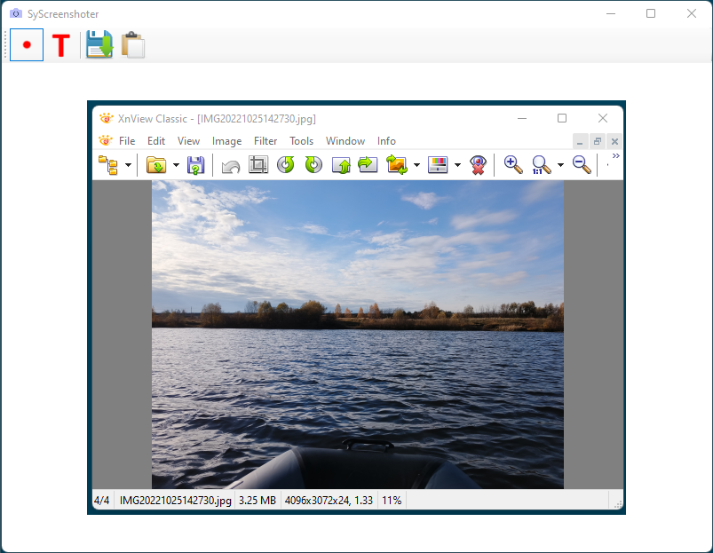

# SyScreenshoter

Simple application to make screenshots. One `*.exe` without additional files.

## Requirements

 * Windows 7+ (x64)

## Using

 * run
 * select area to capture
 * fix captured image (use pen or text tool)
 * save or copy to clipboard

## Donuts

 This project fully free and open-source. You can help the project by sending a [small donut via Tinkoff](https://www.tinkoff.ru/cf/1P754cLgSiB).
